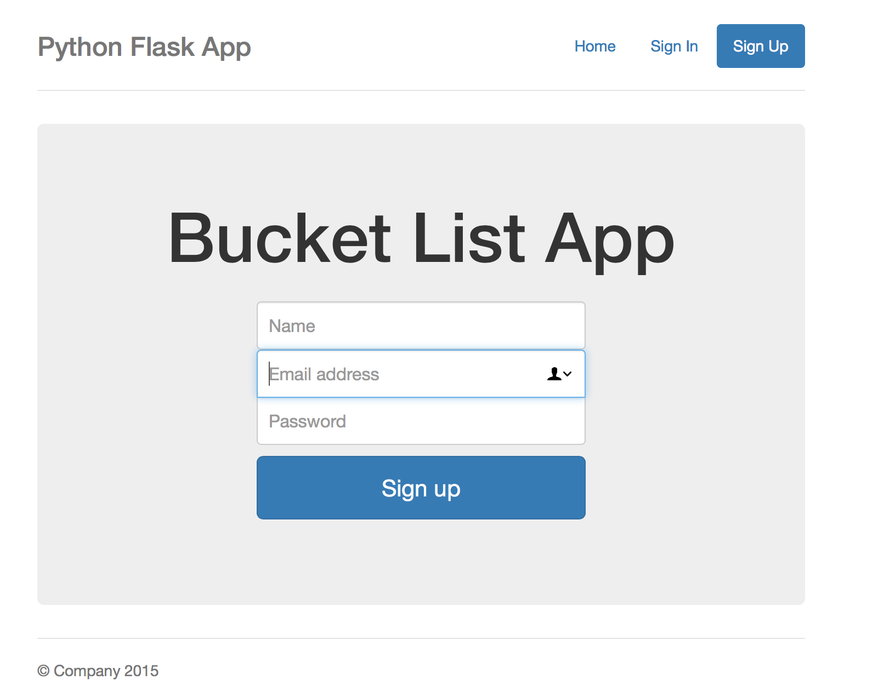
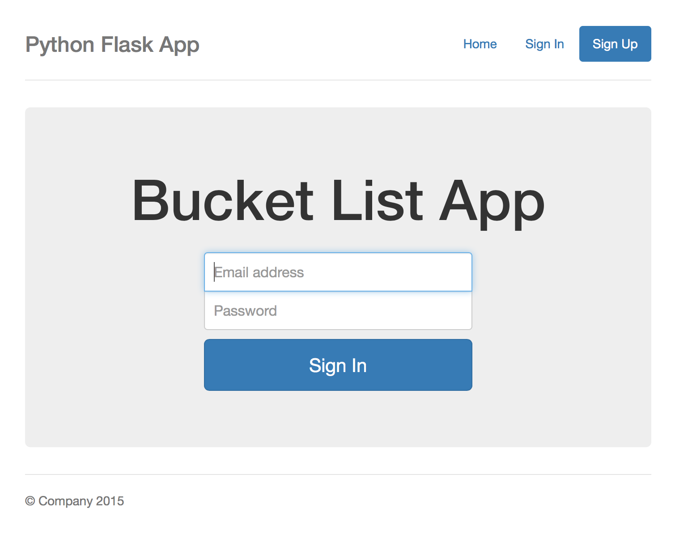

# bucketList
Playing around with backend. Learning how to add different backend functionality using flask
I was able to create this using flask and bootstrap.
<h1>Home Page>

the home page is meant to display the items that a user will post to their bucket list after logging in

<h1>sign up</h1>

Here the user can create an account and add it to the mySQL database I created to store user information

<h1>sign in</h1>

 I created sign in functionality so that a user can log in. The log in works by querying the database and checking to see if the user exists

 

... more functionality to come

